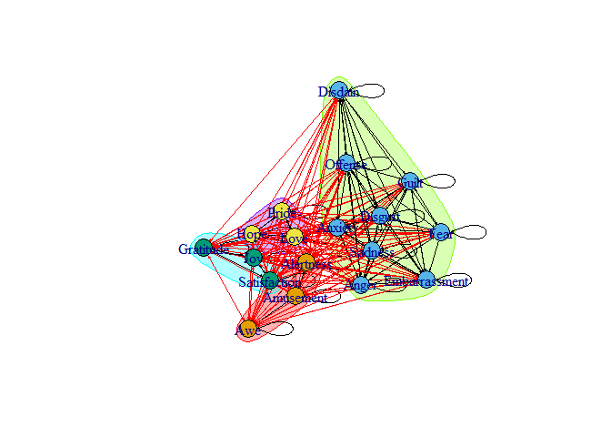
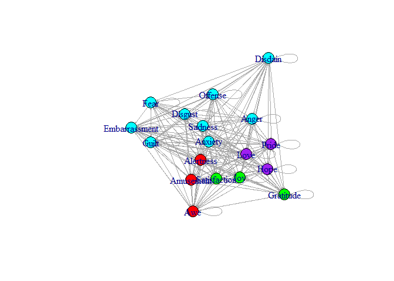
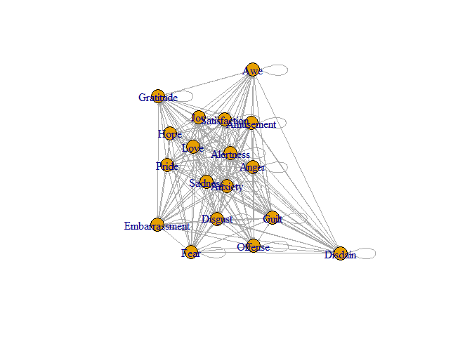
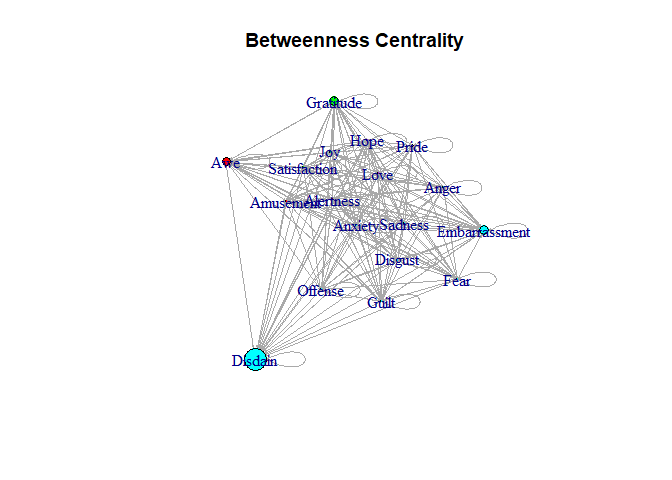
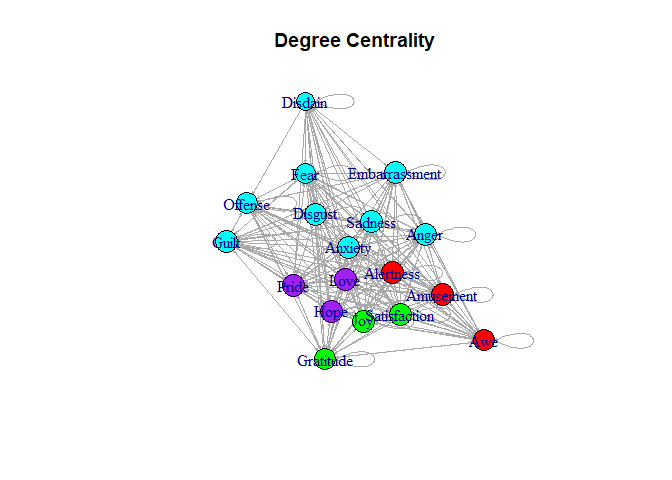
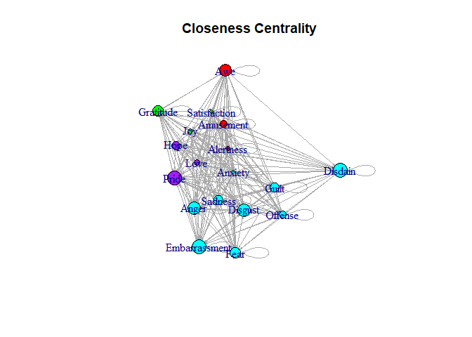
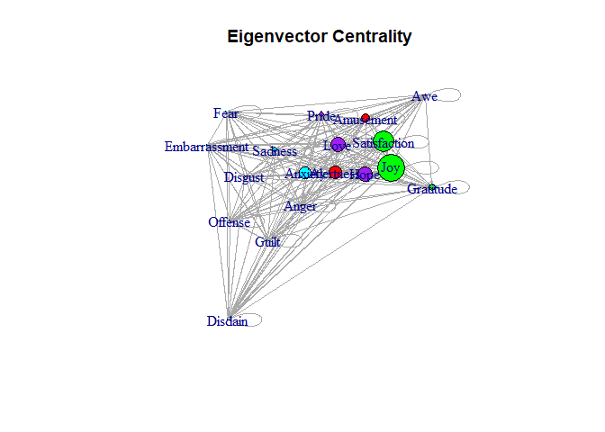

# Data Cleaning

``` r
# reading in the data
load("./Emotions.RData")

# converting from wide to long
# filtering for 1 as we are interested in the emotion that was felt at the particular time of day
emotion_long <- emotion_raw %>%
  gather(., emotion, value, 4:21) %>% 
  arrange(id, Day) %>% 
  filter(value == 1) %>% 
  select(-value)

# since we need to establish edges, we will need the initial emotion (from column) and the next emotion (to column)
emotion_E <- emotion_long %>%
  rename(initial_emotion = emotion) %>% 
  mutate(next_emotion = lead(initial_emotion)) %>% 
  select(id, Day, Hours, initial_emotion, next_emotion) %>% 
  group_by(id) %>% 
  slice(-length(id))
# needed to remove last row in each id so a person's next emotion doesn't overlap with another person's initial emotion

# need to make the nodes  
emotion_N <- emotion_long %>% 
  count(emotion) %>% 
  rowid_to_column("id")

# weight need to be equal to the number of times there is a co-occurrence
emotion_net <- emotion_E %>% 
  group_by(initial_emotion, next_emotion) %>% 
  summarize(weight = n()) %>% 
  ungroup() %>% 
  select(initial_emotion, next_emotion, weight)

# creating the graph object
emotion_g <- graph_from_data_frame(emotion_net)
```

# EDA

``` r
# community detection (by optimizing modularity over partitions)
clp <- cluster_optimal(emotion_g)
class(clp)
```

    ## [1] "communities"

``` r
# plotting
plot(clp, emotion_g,
     edge.arrow.size = 0.125)
```

<!-- -->

``` r
# coloring nodes by community (avoiding use of cluster color easier visualization)
V(emotion_g)$community <- clp$membership
colrs <- adjustcolor(c("red", "cyan", "green", "purple"))
plot(emotion_g, 
     vertex.color = colrs[V(emotion_g)$community],
     edge.arrow.size = 0.125)
```

<!-- --> Four
clusters appear:

1.  Disdain, Offense, Fear, Disgust, Anxiety, Sadness, Anger, Guilt, and
    Embarrassment
2.  Pride, Love, and Hope
3.  Satisfaction, Joy, and Gratitude
4.  Alertness, Amusement, and Awe

Cluster one appears to have predominately negative emotions, whereas the
other three clusters could be described as positive emotions.

# Picking a Centrality Measure

``` r
# plotting the graph object
plot(emotion_g,
     edge.arrow.size = 0.125)
```

<!-- -->

``` r
igraph::degree(emotion_g)
```

    ##     Alertness     Amusement         Anger       Anxiety           Awe 
    ##            36            36            36            36            34 
    ##       Disdain       Disgust Embarrassment          Fear     Gratitude 
    ##            30            36            35            33            34 
    ##         Guilt          Hope           Joy          Love       Offense 
    ##            35            36            36            36            34 
    ##         Pride       Sadness  Satisfaction 
    ##            35            36            36

``` r
# alertness, amusement, anger, anxiety, disgust, hope, joy, love, sadness, and satisfaction all have the highest degree centrality at 36

igraph::eigen_centrality(emotion_g)$vector
```

    ##     Alertness     Amusement         Anger       Anxiety           Awe 
    ##       0.49121       0.32250       0.09393       0.43604       0.10573 
    ##       Disdain       Disgust Embarrassment          Fear     Gratitude 
    ##       0.01051       0.08990       0.03669       0.03804       0.24144 
    ##         Guilt          Hope           Joy          Love       Offense 
    ##       0.04478       0.54807       1.00000       0.53458       0.04505 
    ##         Pride       Sadness  Satisfaction 
    ##       0.20024       0.18191       0.77667

``` r
# Joy stands out among the rest at a value of 1. Satisfaction comes in second at a value of 0.77667.
# Interestingly enough, disdain is very low at a value of 0.01051.

igraph::closeness(emotion_g)
```

    ##     Alertness     Amusement         Anger       Anxiety           Awe 
    ##      0.002646      0.004367      0.007353      0.002227      0.006803 
    ##       Disdain       Disgust Embarrassment          Fear     Gratitude 
    ##      0.007937      0.007353      0.008264      0.006135      0.006289 
    ##         Guilt          Hope           Joy          Love       Offense 
    ##      0.005319      0.004902      0.003247      0.003534      0.004367 
    ##         Pride       Sadness  Satisfaction 
    ##      0.008264      0.005464      0.002160

``` r
# pride has the highest closeness centrality at 0.008264
# anxiety has the lowest closeness centrality at 0.002227

igraph::betweenness(emotion_g)
```

    ##     Alertness     Amusement         Anger       Anxiety           Awe 
    ##          0.00          6.00          0.00          0.00         70.50 
    ##       Disdain       Disgust Embarrassment          Fear     Gratitude 
    ##        178.00          0.00         76.00          2.00         75.00 
    ##         Guilt          Hope           Joy          Love       Offense 
    ##          2.00          0.00          0.00          0.00          4.50 
    ##         Pride       Sadness  Satisfaction 
    ##         20.17          0.00          0.00

``` r
# disdain has the highest betweenness by far at 178
```

I’m deciding to use betweenness as the centrality measure to determine
which emotion is most central. Betweenness centrality essentially tells
us how involved a node is within another node’s path. If a node has a
high betweenness centrality, then it means lots of nodes must pass
through it in order to reach another node, which is a good measure of
how important a node is to a network. I tried looking at degree and
closeness centrality; however, a lot of the emotions were relatively
close to one another, whereas with betweenness, the emotion valued the
highest was disdain at 178, whereas the next closest emotion was
embarrassment at a value of 76. In this case, it means that disdain is
the most central emotion. The least central motion based off of the
betweenness centrality consisted of alertness, anger, anxiety, disgust,
hope, joy, love, sadness, and satisfaction at a value of 0.

# Comparing Centrality Measures

``` r
# let's start by scaling node size with my measure of choice, betweenness
plot(emotion_g, 
     vertex.color = colrs[V(emotion_g)$community],
     vertex.size = igraph::betweenness(emotion_g)/10,
     edge.arrow.size = 0.125,
     main = "Betweenness Centrality")
```

<!-- -->

``` r
# scaling by degree centrality
plot(emotion_g, 
     vertex.color = colrs[V(emotion_g)$community],
     vertex.size = igraph::degree(emotion_g)/2,
     edge.arrow.size = 0.125,
     main = "Degree Centrality")
```

<!-- -->

``` r
# scaling by closeness centrality
plot(emotion_g, 
     vertex.color = colrs[V(emotion_g)$community],
     vertex.size = igraph::closeness(emotion_g)*2000,
     edge.arrow.size = 0.125,
     main = "Closeness Centrality")
```

<!-- -->

``` r
# scaling by eigenvector centrality
plot(emotion_g, 
     vertex.color = colrs[V(emotion_g)$community],
     vertex.size = igraph::eigen_centrality(emotion_g)$vector*25,
     edge.arrow.size = 0.125,
     main = "Eigenvector Centrality")
```

<!-- --> As
expressed before, disdain stands out among the rest when scaling nodal
size by betweenness centrality.

Difficult to make meaningful inferences from the degree centrality as
they are all very similar to one another.

Pride, embarrassment, and disdain stand out as the important nodes when
looking at closeness centrality.

The Eigenvector centrality interested me, as I would’ve expected disdain
to be relatively high due to its high betweenness centrality. However,
it has one of the lowest Eigenvector centralities, whereas joy has the
highest (1). Eigenvector centrality tells us how much of an influence a
node has over a network based on how many other nodes it is connected to
that are also scored highly regarding Eigenvector centrality.
Interestingly enough, Joy has a betweenness centrality of 0, so I’m
assuming that it isn’t essential for other nodes to pass through it, but
it happens to be connected to a lot of important nodes. For this reason,
I’ll stand by my claim that betweenness centrality is the better measure
to evaluate in this situation, and that disdain is the most central
emotion.
