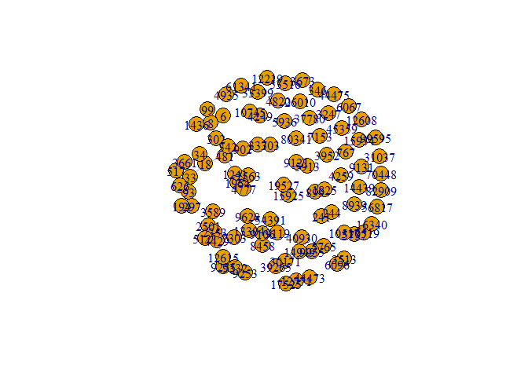
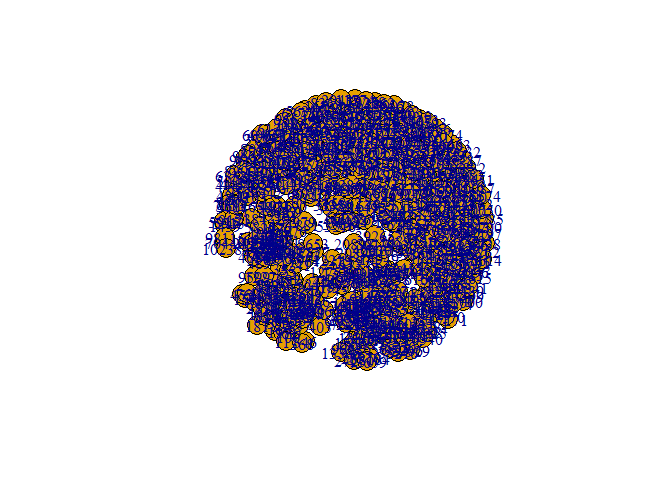

``` r
# reading in the data
amazon_E <- fread("~/COLLEGE/GRAD SCHOOL/GDAT622/amazon-2003-03-02.txt")
```

    ## Warning in fread("~/COLLEGE/GRAD SCHOOL/GDAT622/amazon-2003-03-02.txt"):
    ## Detected 1 column names but the data has 2 columns (i.e. invalid file). Added 1
    ## extra default column name for the first column which is guessed to be row names
    ## or an index. Use setnames() afterwards if this guess is not correct, or fix the
    ## file write command that created the file to create a valid file.

``` r
# cleaning up the edgelist
colnames(amazon_E)[1] <- "FromNodeId"
colnames(amazon_E)[2] <- "ToNodeId"
# replacing zeroes with x to avoid error when making the graph
amazon_E[amazon_E == 0] <- "x"

# converting to a matrix
mat <- as.matrix(amazon_E)

# creating the graph object
g <- graph_from_edgelist(mat, directed = FALSE)

# will take VERY long
# plot(g,
#      edge.arrow.size = 0.05,
#      vertex.size = 0.5)

# let's trying reducing the size of the network
# pruning via louvain method
clus <- cluster_louvain(g)
# it assigned 210 groups
clus
```

    ## IGRAPH clustering multi level, groups: 210, mod: 0.92
    ## + groups:
    ##   $`1`
    ##      [1] "138"    "302"    "303"    "230"    "231"    "636"    "481"    "479"   
    ##      [9] "333"    "335"    "336"    "337"    "338"    "480"    "483"    "484"   
    ##     [17] "342"    "511"    "364"    "365"    "1141"   "1149"   "1150"   "1151"  
    ##     [25] "785"    "1152"   "1153"   "1154"   "1155"   "1156"   "1157"   "696"   
    ##     [33] "885"    "1158"   "699"    "701"    "703"    "390"    "391"    "392"   
    ##     [41] "724"    "725"    "900"    "403"    "1171"   "1172"   "1173"   "1174"  
    ##     [49] "784"    "1672"   "1673"   "1205"   "1206"   "1207"   "1688"   "1689"  
    ##     [57] "1690"   "1235"   "849"    "850"    "851"    "1584"   "1294"   "1295"  
    ##     [65] "1296"   "1297"   "1298"   "899"    "1299"   "1300"   "1301"   "1302"  
    ##   + ... omitted several groups/vertices

``` r
# this alone will take VERY long
# let's try this again later, but after pruning
# plot(g, vertex.color = rainbow(210, alpha = 0.6)[clus$membership],
#      vertex.label = NA,
#      edge.arrow.size = 0.05,
#      vertex.size = 1)
```

Might be worthwhile looking at individual groups before trying to run
the entire network.

# Group 210

``` r
# let's try looking at one of the groups
group210 <- copy(clus[210])

# subsetting from amazon_E based on nodes in group 210
group210_E <- subset(amazon_E, FromNodeId %in% group210$`210`)

g210 <- graph_from_data_frame(group210_E)
 
plot(g210,
     edge.arrow.size = 0.15,
     main = "Group 210")
```

<!-- -->

``` r
igraph::betweenness(g210)
```

    ##   215958   227084   227085   227086   227087   227088   236491   237278 
    ##  14.5000  40.0000  13.5833  29.5000 109.9167  18.5833 135.3333  29.3333 
    ##   240392   261735   261736   261737   261738   261773   261847   261948 
    ##   0.5833  40.3333   6.6667   3.3333   3.3333   0.0000  45.0000   0.0000 
    ##    17600   240393    10434 
    ##   0.0000   0.0000   0.0000

``` r
igraph::degree(g210)
```

    ## 215958 227084 227085 227086 227087 227088 236491 237278 240392 261735 261736 
    ##     11      9      9     12     13     10     13      7      6     11     11 
    ## 261737 261738 261773 261847 261948  17600 240393  10434 
    ##     10     10      8      7      2      1      1      1

I looked at a particular cluster in this network, which featured the 6
items below. Node 261847 (Music: A Golden Hour of Comedy) was in the
center of the cluster.

Id: 261847 title: A Golden Hour of Comedy group: Music salesrank: 263401
similar: 0 categories: 5
|Music\[5174\]|Styles\[301668\]|Miscellaneous\[35\]|Poetry, Spoken Word
& Interviews\[603190\]|General\[63951\]
|Music\[5174\]|Styles\[301668\]|Miscellaneous\[35\]|General\[170942\]
|Music\[5174\]|Styles\[301668\]|Miscellaneous\[35\]|Compilations\[466080\]|Comedy\[466088\]
|Music\[5174\]|Styles\[301668\]|Miscellaneous\[35\]|Comedy\[63936\]|General\[466982\]
|Music\[5174\]|Specialty Stores\[468040\]|Indie
Music\[266023\]|Miscellaneous\[171247\]|Comedy & Spoken Word\[520240\]
reviews: total: 0 downloaded: 0 avg rating: 0

Id: 10434 title: Rainbow Palace group: Music salesrank: 27222 similar: 5
B0000BV0HG B0000BV0HN B00000AF5X B0000BV0HJ B0000BV0HI categories: 1
|Music\[5174\]|Styles\[301668\]|Children’s
Music\[173425\]|General\[173426\] reviews: total: 2 downloaded: 2 avg
rating: 5

Id: 261948 title: What Shall I Draw (What Shall I Do Today Series)
group: Book salesrank: 495249 similar: 5 074603704X 0746029438
0746028598 0746028024 0439140072 categories: 1
|Books\[283155\]|Subjects\[1000\]|Children’s Books\[4\]|Arts &
Music\[2870\]|Art\[2872\]|Drawing\[2874\] reviews: total: 3 downloaded:
3 avg rating: 4.5

Id: 261735 title: Great Days: The John Prine Anthology group: Music
salesrank: 1723 similar: 5 B0007VROHE B00000K3LI B000002I97 B0000005XY
B0000005Y2 categories: 5
|Music\[5174\]|Styles\[301668\]|Country\[16\]|General\[63695\]
|Music\[5174\]|Styles\[301668\]|Folk\[32\]|Contemporary
Folk\[598642\]|General\[63714\]
|Music\[5174\]|Styles\[301668\]|Folk\[32\]|General\[63716\]
|Music\[5174\]|Labels\[892976\]|Amazon.com Label Stores\[301122\]|Rhino
Records\[574566\]
|Music\[5174\]|Styles\[301668\]|Folk\[32\]|Contemporary
Folk\[598642\]|Singer-Songwriters\[598644\] reviews: total: 31
downloaded: 31 avg rating: 5

Id: 261736 ASIN: 0520234901 title: Westward Dharma: Buddhism beyond Asia
group: Book salesrank: 613087 similar: 5 0520216970 0520213017
0700712046 0195152417 0231108699 categories: 2
|Books\[283155\]|Subjects\[1000\]|Religion &
Spirituality\[22\]|Buddhism\[12279\]|General\[12282\]
|Books\[283155\]|Subjects\[1000\]|Religion &
Spirituality\[22\]|Buddhism\[12279\]|Dharma\[297499\] reviews: total: 0
downloaded: 0 avg rating: 0

Id: 236491 title: Sat II: Writing 2000-2001 (Sat II. Writing) group:
Book salesrank: 842047 similar: 5 0764123467 0743241231 0375763015
0743251962 0131828010 categories: 2
|Books\[283155\]|Subjects\[1000\]|Reference\[21\]|Education\[11628\]|Test
Guides - College & University\[11668\]|SAT & PSAT\[11682\]
|Books\[283155\]|Subjects\[1000\]|Reference\[21\]|Test Prep
Central\[11904\]|General\[408252\] reviews: total: 8 downloaded: 8 avg
rating: 3.5

Three songs and three books were featured in this cluster. The three
songs were pretty different from one another, with A Golden Hour of
Comedy being categorized as a comedic/indie song, Rainbow Palace being a
children’s song, and Great Days: The John Prine Anthology being a
country/folk song. The three books were also relatively unrelated to one
another. What Shall I Draw (What Shall I Do Today Series) is a
children’s art book, Westward Dharma: Buddhism beyond Asia revolves
around religion (Buddhism) and spirituality, and Sat II: Writing
2000-2001 (Sat II. Writing) is an educational book regarding SAT
preparation.

Regarding the books, there at least seems to be an educational theme to
them, although it applies to people of varying age groups (e.g. What
Shall I Draw (What Shall I Do Today Series) being a book to teach
children art, Sat II: Writing 2000-2001 (Sat II. Writing) being
something that a highschool student would use, and Westward Dharma:
Buddhism beyond Asia being something that a college student may need for
a liberal arts course).

# Community Detection Algorithm

``` r
amazon_spinglass <- igraph::cluster_spinglass(g)
plot(amazon_spinglass, g)
```

<!-- -->
Seeing as this is a large amount of data, it will be difficult to get
anything meaningful from the plot. We’ll need to get this network to be
smaller and smaller.

# Pruning by Degree

``` r
g_degree <- igraph::degree(g)
max(g_degree)
```

    ## [1] 425

``` r
min(g_degree)
```

    ## [1] 1

``` r
mean(g_degree)
```

    ## [1] 9.423

``` r
# getting rid of any nodes with a degree less than 100
g_sub <- delete_vertices(g, V(g)[igraph::degree(g) < 100])

plot(g_sub)
```

<!-- -->

``` r
# here's the code from the louvain cluster shown earlier
# now applied to g_sub
plot(g_sub, vertex.color = rainbow(210, alpha = 0.6)[clus$membership],
     vertex.label = NA,
     edge.arrow.size = 0.15,
     vertex.size = 8.5)
```

<!-- -->

# Pruning by Degree Centrality then Betweenness Centrality

``` r
g_sub2 <- induced.subgraph(g, vids = V(g)[igraph::degree(g)] > 50)

plot(g_sub2)
```

<!-- -->

``` r
# we've filtered for degree values above 50; however, it's still difficult to view

# let's prune this subgraph by betweenness
g_sub2_bw <- igraph::betweenness(g_sub2)
max(g_sub2_bw)
```

    ## [1] 13678

``` r
min(g_sub2_bw)
```

    ## [1] 0

``` r
mean(g_sub2_bw)
```

    ## [1] 273.8

``` r
g_sub3 <- induced.subgraph(g_sub2, vids = V(g_sub2)[igraph::betweenness(g_sub2) > 250])

plot(g_sub3,
     vertex.size = 8.5,
     vertex.label.cex = 0.80,
     main = "Degree > 50 & Betweenness > 250")
```

<!-- -->

``` r
# much easier to visualize
```

I figured filtering for relatively high values of degree would be sound
as we’d able to see those nodes that have high links between other
nodes. Following this, filtering for a relatively high betweenness
allows us to understand which nodes are integral parts of the network,
as many nodes will need to pass through those that have a higher
betweenness centrality.

In this plot, we see that nodes 7628, 3464, and 21 are gatekeepers, as
each node must go through them in order to reach the nodes on the
opposite side. Listed below are what those items were according to the
Amazon metadata:

Id: 3464 title: Ultimate Sniper group: Video salesrank: 24375 similar: 5
B00004XQPE 1571199454 6305120862 B00007GCYU B000056HJ4 categories: 2
|\[139452\]|VHS\[404272\]|Genres\[404274\]|Documentary\[508530\]|Military
& War\[169897\]|General\[169899\]
|\[139452\]|VHS\[404272\]|Genres\[404274\]|Special
Interests\[135\]|General\[407858\] reviews: total: 5 downloaded: 5 avg
rating: 4

Id: 7628 title: Stories for a Teacher’s Heart (Stories For the Heart)
group: Book salesrank: 873929 similar: 0 categories: 3
|Books\[283155\]|Subjects\[1000\]|Literature & Fiction\[17\]|Books &
Reading\[9988\]|Reference\[10011\]
|Books\[283155\]|Subjects\[1000\]|Literature &
Fiction\[17\]|General\[10125\]|Classics\[10127\]
|Books\[283155\]|Subjects\[1000\]|Religion &
Spirituality\[22\]|Spirituality\[12809\]|Inspirational\[12817\] reviews:
total: 0 downloaded: 0 avg rating: 0

Id: 21 title: The Time Machine group: DVD salesrank: 795 similar: 5
B00007JMD8 6305350221 B00004RF9B B00005JKFR B00005NG6A categories: 26
|\[139452\]|DVD\[130\]|Genres\[404276\]|Drama\[163379\]|General\[163390\]
|\[139452\]|DVD\[130\]|Genres\[404276\]|Science Fiction &
Fantasy\[163431\]|Fantasy\[163440\]
|\[139452\]|DVD\[130\]|Genres\[404276\]|Science Fiction &
Fantasy\[163431\]|General\[163442\]
|\[139452\]|DVD\[130\]|Genres\[404276\]|Science Fiction &
Fantasy\[163431\]|Classic Sci-Fi\[292650\]
|\[139452\]|DVD\[130\]|Genres\[404276\]|Science Fiction &
Fantasy\[163431\]|Monsters & Mutants\[292662\]
|\[139452\]|DVD\[130\]|Genres\[404276\]|Science Fiction &
Fantasy\[163431\]|By Theme\[292669\]|Time Travel\[292667\]
|\[139452\]|DVD\[130\]|Actors & Actresses\[404278\]|( B
)\[411316\]|Bissell, Whit\[413160\] |\[139452\]|DVD\[130\]|Actors &
Actresses\[404278\]|( C )\[416120\]|Cabot, Sebastian\[416132\]
|\[139452\]|DVD\[130\]|Actors & Actresses\[404278\]|( F
)\[422476\]|Frees, Paul\[423942\] |\[139452\]|DVD\[130\]|Actors &
Actresses\[404278\]|( H )\[426368\]|Helmore, Tom\[427584\]
|\[139452\]|DVD\[130\]|Actors & Actresses\[404278\]|( L
)\[432148\]|Lloyd, Doris\[433832\] |\[139452\]|DVD\[130\]|Actors &
Actresses\[404278\]|( M )\[434574\]|Mimieux, Yvette\[437458\]
|\[139452\]|DVD\[130\]|Actors & Actresses\[404278\]|( T
)\[448792\]|Taylor, Rod\[449112\] |\[139452\]|DVD\[130\]|Actors &
Actresses\[404278\]|( Y )\[453438\]|Young, Alan\[453620\]
|\[139452\]|DVD\[130\]|Directors\[403502\]|( P )\[460606\]|Pal,
George\[460622\] |\[139452\]|DVD\[130\]|Genres\[404276\]|Art House &
International\[163313\]|By Theme\[502916\]|Costume Adventures\[502980\]
|\[139452\]|DVD\[130\]|Genres\[404276\]|Drama\[163379\]|Classics\[524228\]
|\[139452\]|DVD\[130\]|Special Features\[408328\]|Today’s Deals in
DVD\[409298\]|Deals Under $15\[565160\] |\[139452\]|DVD\[130\]|Special
Features\[408328\]|Titles\[579510\]|( T )\[579550\]
|\[139452\]|DVD\[130\]|Genres\[404276\]|Art House &
International\[163313\]|By Country\[284926\]|United
Kingdom\[579580\]|General\[579588\] |\[139452\]|DVD\[130\]|Specialty
Stores\[498862\]|Studio Specials\[468374\]|Warner Home
Video\[515794\]|Drama\[600318\] |\[139452\]|DVD\[130\]|Specialty
Stores\[498862\]|Studio Specials\[468374\]|Warner Home
Video\[515794\]|All Titles\[600330\] |\[139452\]|DVD\[130\]|Specialty
Stores\[498862\]|Studio Specials\[468374\]|Warner Home
Video\[515794\]|Classics\[600334\] |\[265523\]|Amazon.com
Stores\[285080\]|Amazon.com Outlet\[517808\]|Categories\[526028\]|DVD
Outlet\[734006\]|Deals Under $15\[734042\]
|\[139452\]|DVD\[130\]|Genres\[404276\]|Science Fiction &
Fantasy\[163431\]|Futuristic\[735728\] |\[139452\]|DVD\[130\]|Specialty
Stores\[498862\]|Studio Specials\[468374\]|Warner Home
Video\[515794\]|DVDs Under $15\[1038542\] reviews: total: 140
downloaded: 140 avg rating: 4.5

The Time Machine is a popular item with a sales rank of 795.

# Scaling g\_sub3 by Eigenvector Centrality

``` r
# scaling g_sub3 by eigenvector centrality
plot(g_sub3,
     vertex.size = igraph::eigen_centrality(g_sub3)$vector*5,
     edge.arrow.size = 0.125,
     main = "g_sub3 Scaled by Eigenvector Centrality")
```

<!-- -->
Nodes 4429, 5120, 2353 all stood out when this network was scaled by
Eigenvector centrality. This indicates that these node Their items are
listed below:

Id: 4429 title: Harley-Davidson Panheads, 1948-1965/M418 group: Book
salesrank: 147799 similar: 5 0760310629 0967274400 0879389346 0892875666
076030226X categories: 4 |Books\[283155\]|Subjects\[1000\]|Home &
Garden\[48\]|Antiques & Collectibles\[5066\]|Transportation\[5076\]
|Books\[283155\]|Subjects\[1000\]|Nonfiction\[53\]|Automotive\[10503\]|Motorcycles\[10520\]|General\[10521\]
|Books\[283155\]|Subjects\[1000\]|Nonfiction\[53\]|Automotive\[10503\]|Motorcycles\[10520\]|Repair
& Performance\[10525\]
|Books\[283155\]|Subjects\[1000\]|Nonfiction\[53\]|Transportation\[11934\]|General\[11947\]
reviews: total: 3 downloaded: 3 avg rating: 4.5 1999-1-27 cutomer:
A1X0D5EB937DEI rating: 5 votes: 19 helpful: 19 2001-4-14 cutomer:
A7UGKKVF6PH21 rating: 5 votes: 8 helpful: 7 2003-11-15 cutomer:
A1Y3J71SBICPX9 rating: 4 votes: 0 helpful: 0

Id: 5120 title: Tae Kwon Do for Women group: Book salesrank: 844576
similar: 2 0816038392 0873644921 categories: 4
|Books\[283155\]|Subjects\[1000\]|Health, Mind & Body\[10\]|Mental
Health\[4682\]|Abuse & Self Defense\[4683\]|Self Defense\[4686\]
|Books\[283155\]|Subjects\[1000\]|Sports\[26\]|Individual
Sports\[16533\]|Martial Arts\[16571\]|General\[16575\]
|Books\[283155\]|Subjects\[1000\]|Sports\[26\]|Individual
Sports\[16533\]|Martial Arts\[16571\]|Tai Kwon Do\[16581\]
|Books\[283155\]|Subjects\[1000\]|Sports\[26\]|General\[11086921\]
reviews: total: 0 downloaded: 0 avg rating: 0

Id: 2353 title: Committed group: Music salesrank: 437762 similar: 0
categories: 4
|Music\[5174\]|Styles\[301668\]|International\[33\]|General\[63848\]
|Music\[5174\]|Styles\[301668\]|Pop\[37\]|General\[67172\]
|Music\[5174\]|Specialty Stores\[468040\]|Indie
Music\[266023\]|International\[171245\]|General\[520182\]
|Music\[5174\]|Specialty Stores\[468040\]|Indie
Music\[266023\]|Pop\[171249\]|General\[520274\] reviews: total: 4
downloaded: 4 avg rating: 5 2002-1-30 cutomer: APONWVS6M0OHF rating: 5
votes: 1 helpful: 1 2002-2-1 cutomer: A2Q4GP8S4F6UXO rating: 5 votes: 3
helpful: 3 2002-2-3 cutomer: A3GJYD4IML3UEK rating: 5 votes: 2 helpful:
2 2005-5-14 cutomer: AEGNAFJJ2W1CW rating: 5 votes: 0 helpful: 0

Two books on completely unrelated topics (Harley-Davidson motorcycles
and women’s Tae Kwon Do) and an indie pop song (Committed). It’s
difficult to say as to why these are particularly important, so I would
assume that they happen to be surrounded by other nodes that play an
integral role in this pruned network.
